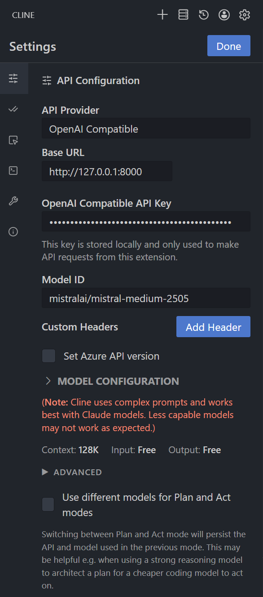
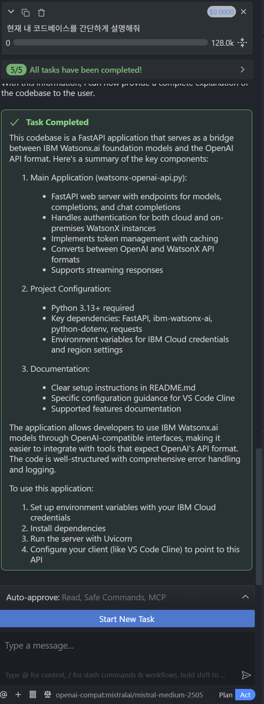

# Watsonx.ai to OpenAI API Bridge

이 프로젝트는 IBM Watsonx.ai의 파운데이션 모델들을 OpenAI API 규격과 호환되도록 변환해주는 가벼운 FastAPI 서버입니다. 이를 통해 **VS Code Cline(구 Claude Dev)**이나 다른 OpenAI 호환 도구에서 Watsonx 모델을 손쉽게 사용할 수 있습니다.

## 🚀 시작하기

### 1. 환경 변수 설정

먼저 프로젝트 루트 디렉토리에 `.env` 파일을 생성하고 아래 내용을 입력합니다. `.env.example` 파일을 복사하여 사용할 수 있습니다.

```env
# IBM Cloud API 키 및 프로젝트 ID
WATSONX_IAM_APIKEY=your_ibm_cloud_api_key
WATSONX_PROJECT_ID=your_project_id

# 지역 설정 (us-south, eu-gb, jp-tok, eu-de 중 선택)
WATSONX_REGION=us-south

# 기타 설정
WATSONX_VERSION=2025-02-06
WATSONX_ON_PREM=0
DOCKER=false

```

### 2. 의존성 설치

필요한 라이브러리를 설치합니다.

```bash
python -m venv .venv
source .venv/bin/activate
pip install -r requirements.txt
```

### 3. 서버 실행

Uvicorn을 사용하여 서버를 기동합니다.

```bash
uvicorn watsonx-openai-api:app --host 127.0.0.1 --port 8000

```

---

## 🛠 VS Code Cline 설정 방법

서버가 실행되면 VS Code의 **Cline** 확장 프로그램에서 다음과 같이 설정하여 Watsonx 모델을 연결할 수 있습니다.

1. Cline의 **Settings** (톱니바퀴 아이콘)를 클릭합니다.
2. **API Provider** 메뉴에서 `OpenAI Compatible`을 선택합니다.
3. 아래 표를 참고하여 각 항목을 입력합니다.

| 항목         | 설정값                                                              |
| ------------ | ------------------------------------------------------------------- |
| **Base URL** | `http://127.0.0.1:8000`                                             |
| **API Key**  | watsonx.ai API Key                                                  |
| **Model ID** | 사용하고자 하는 Watsonx 모델 ID (예: `ibm/granite-3-3-8b-instruct`) |

### 설정 예시 스크린샷

## 

## 📋 지원 기능

- **`/models`**: Watsonx에서 사용 가능한 모델 목록 조회 (OpenAI 형식)
- **`/chat/completions`**: 채팅 완성 인터페이스 (Streaming 지원)
- **`/completions`**: 텍스트 완성 인터페이스

## 💡 참고 사항

- **모델 ID**: `Model ID` 칸에 Watsonx에서 지원하는 모델(예: `mistralai/mistral-large`, `ibm/granite-3-8b-instruct`)을 정확히 입력해야 요청이 정상적으로 처리됩니다.

## 실제 사용 화면

## 
